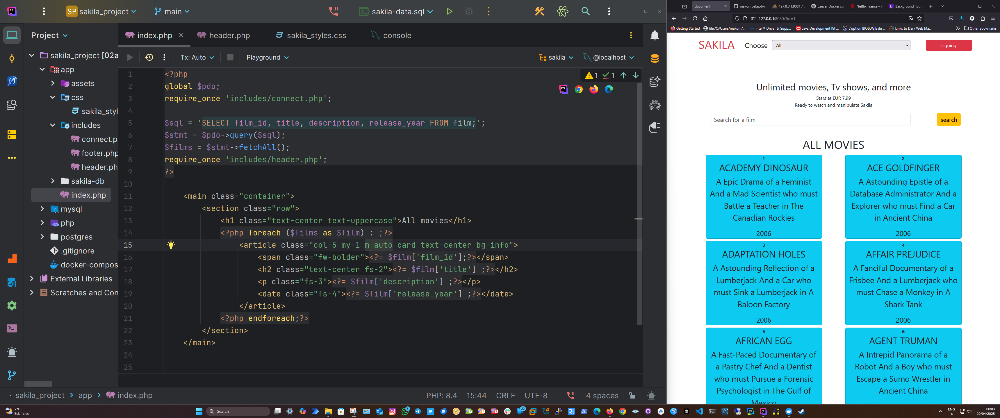

# Sakila Viewer Project

A small personal project to display data from the **Sakila** database inside a **Bootstrap 5**-styled web page.

## 🚀 Project Overview

This project aims to display information from the **Sakila** sample database (official example database for MySQL).  
The interface is simple, responsive, and uses **Bootstrap** for a clean design.

## 🛠️ Technologies Used

- **PHP 8+** (to connect to the database and generate dynamic HTML)
- **MySQL 8+** (Sakila database)
- **HTML5**
- **CSS3** (via Bootstrap 5 CDN)
- **Bootstrap 5.3** (for responsive and fast styling)
- **Docker** (optional, to quickly run MySQL + PHP locally)

## 📦 Project Structure

```plaintext
/ (project root)
│
├── app/
│   ├── index.php   # Main file displaying the data
│   └── assets/
│       └── style.css (optional if you add custom styles)
│
├── docker-compose.yml (optional for easy local setup)
├── README.md
└── ...
🌐 Deployment (Online Hosting)

To publish your project online:

    Upload your project to a web server (Apache/Nginx).

    Install MySQL on the server and import the Sakila database.

    Configure your database connection correctly.

Some hosting suggestions:

    Render, Vercel + PHP Backend, AlwaysData, Hostinger, etc.

📋 Features

Display a list of movies with titles and descriptions.

Use Bootstrap to make the page responsive.

Add a search bar (optional future feature).

    Filter movies by category (optional future feature).

🤔 About this project

This project is a personal exercise to:

    practice PHP ↔ MySQL connections

    work with real-world databases

    improve front-end skills with Bootstrap